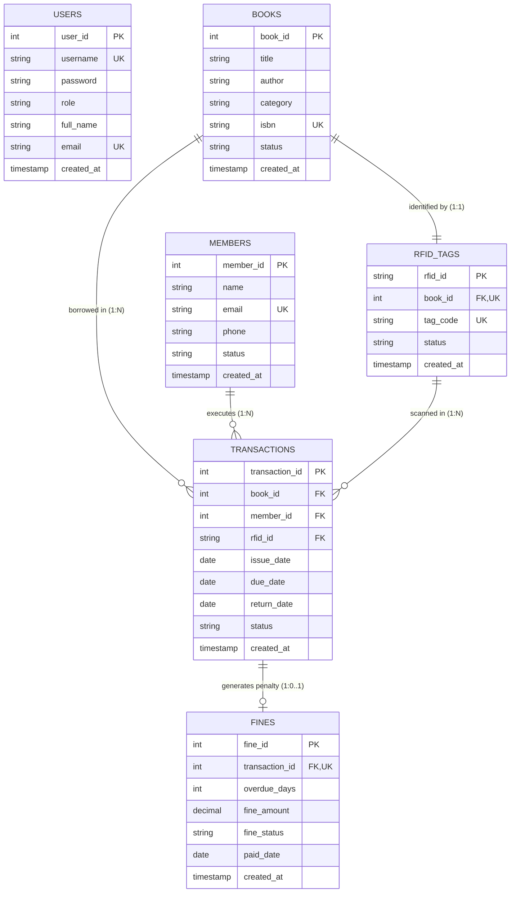

# Entity-Relationship (ER) Diagram

This document models the entity relationships, cardinalities, and attributes of the `library_rfid` MySQL database for academic submission.

---

## 1. Visual Mermaid ER Diagram

---

## 2. Cardinality Analysis for Viva

1. **`BOOKS` to `RFID_TAGS` (1 : 1 Relationship)**
   - Each physical book copy has exactly **one** RFID tag attached to it.
   - Each RFID tag belongs uniquely to **one** book record.
   - Enforced by `UNIQUE(book_id)` in the `rfid_tags` table.

2. **`MEMBERS` to `TRANSACTIONS` (1 : N Relationship)**
   - One library member can execute **many** circulation transactions over time.
   - Each transaction belongs to exactly **one** borrower.

3. **`BOOKS` to `TRANSACTIONS` (1 : N Relationship)**
   - One book title can be borrowed and returned **many** times across its shelf life.
   - Each transaction record references **one** specific book.

4. **`TRANSACTIONS` to `FINES` (1 : 0..1 Relationship)**
   - A transaction generates at most **one** fine record if the return date exceeds the due date.
   - On-time returns generate **zero** fine records.
   - Enforced by `UNIQUE(transaction_id)` in the `fines` table.

---

## 3. Relational Schema Representation
- **USERS** ($\underline{\text{user\_id}}$, username, password, role, full\_name, email, created\_at)
- **BOOKS** ($\underline{\text{book\_id}}$, title, author, category, isbn, status, created\_at)
- **RFID\_TAGS** ($\underline{\text{rfid\_id}}$, $\text{book\_id}^*$, tag\_code, status, created\_at)
- **MEMBERS** ($\underline{\text{member\_id}}$, name, email, phone, status, created\_at)
- **TRANSACTIONS** ($\underline{\text{transaction\_id}}$, $\text{book\_id}^*$, $\text{member\_id}^*$, $\text{rfid\_id}^*$, issue\_date, due\_date, return\_date, status, created\_at)
- **FINES** ($\underline{\text{fine\_id}}$, $\text{transaction\_id}^*$, overdue\_days, fine\_amount, fine\_status, paid\_date, created\_at)
