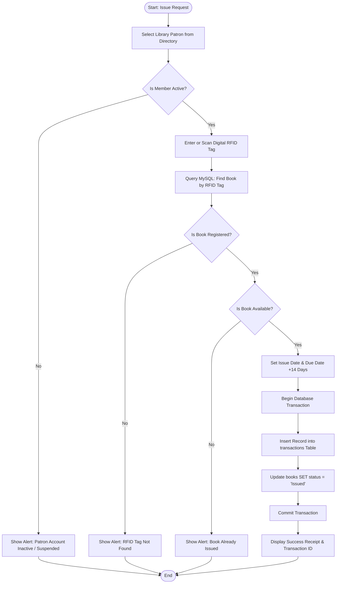
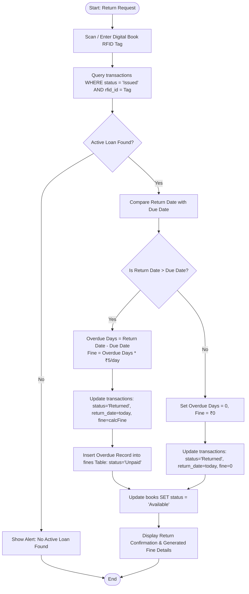
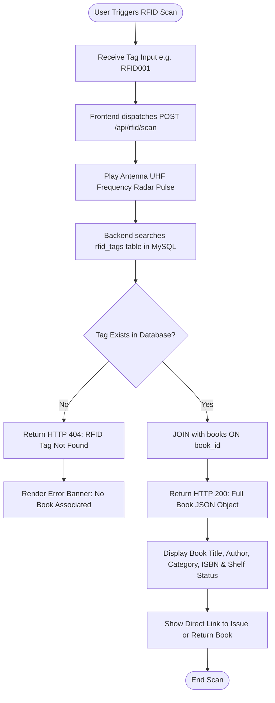
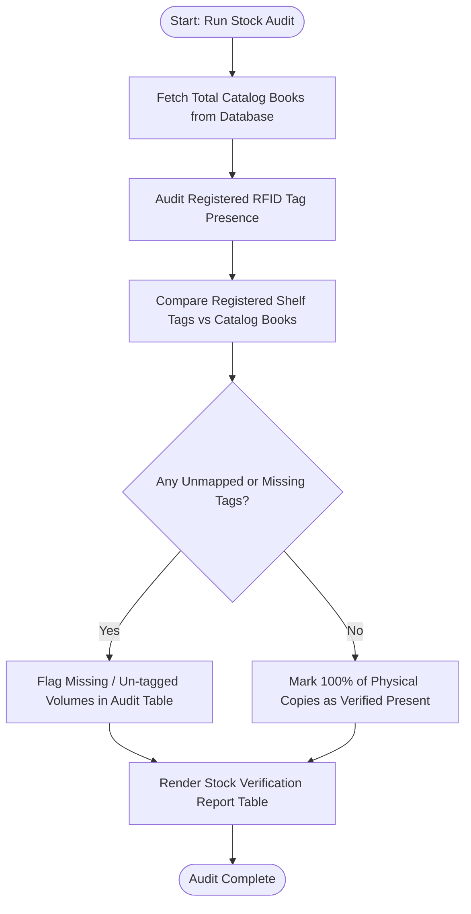

# System Flowcharts

This document models the core operational processes of the Library Management System with RFID Integration using standard workflow flowcharts.

---

## 1. Automated Book Issue Workflow

---

## 2. Automated Book Return & Fine Engine Workflow

---

## 3. RFID Software Simulation Scanner Workflow

---

## 4. Stock Verification & Inventory Audit Flowchart

